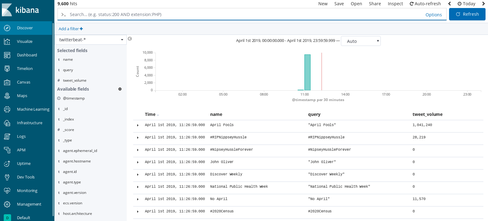
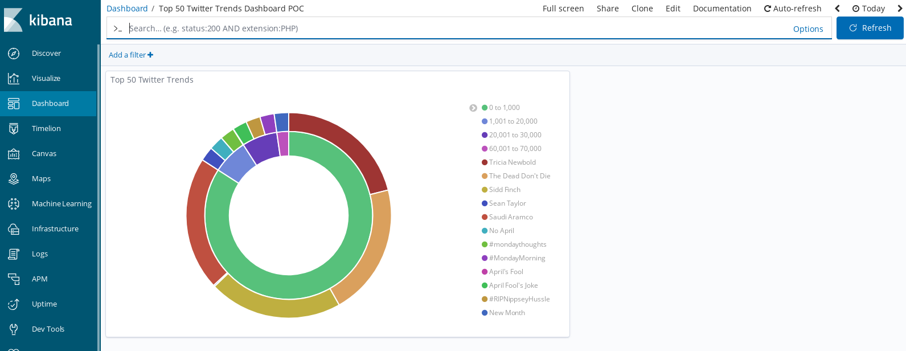

# Twitterbeat

Welcome to Twitterbeat.

This beat gets the top 50 searches/hashtags.

See the below example of the beats result as a Kibana dashboard, using a pie chart visualization organized by volume of tweets, followed by name of query (or search term).





To use the Twitterbeat Beat, it is necessary to get Twitter application credentials, and store your resulting Bearer token as the BEARER_TOKEN environment variable. Of course, you can change this environment name in the configuration.

Ensure that this folder is at the following location:
`${GOPATH}/src/github.com/marcelluseasley/twitterbeat`

## Getting Started with Twitterbeat

### Requirements

* [Golang](https://golang.org/dl/) 1.7

### Init Project
To get running with Twitterbeat and also install the
dependencies, run the following command:

```
make setup
```

It will create a clean git history for each major step. Note that you can always rewrite the history if you wish before pushing your changes.

To push Twitterbeat in the git repository, run the following commands:

```
git remote set-url origin https://github.com/marcelluseasley/twitterbeat
git push origin master
```

For further development, check out the [beat developer guide](https://www.elastic.co/guide/en/beats/libbeat/current/new-beat.html).

### Build

To build the binary for Twitterbeat run the command below. This will generate a binary
in the same directory with the name twitterbeat.

```
make
```


### Run

To run Twitterbeat with debugging output enabled, run:

```
./twitterbeat -c twitterbeat.yml -e -d "*"
```


### Test

To test Twitterbeat, run the following command:

```
make testsuite
```

alternatively:
```
make unit-tests
make system-tests
make integration-tests
make coverage-report
```

The test coverage is reported in the folder `./build/coverage/`

### Update

Each beat has a template for the mapping in elasticsearch and a documentation for the fields
which is automatically generated based on `fields.yml` by running the following command.

```
make update
```


### Cleanup

To clean  Twitterbeat source code, run the following command:

```
make fmt
```

To clean up the build directory and generated artifacts, run:

```
make clean
```


### Clone

To clone Twitterbeat from the git repository, run the following commands:

```
mkdir -p ${GOPATH}/src/github.com/marcelluseasley/twitterbeat
git clone https://github.com/marcelluseasley/twitterbeat ${GOPATH}/src/github.com/marcelluseasley/twitterbeat
```


For further development, check out the [beat developer guide](https://www.elastic.co/guide/en/beats/libbeat/current/new-beat.html).


## Packaging

The beat frameworks provides tools to crosscompile and package your beat for different platforms. This requires [docker](https://www.docker.com/) and vendoring as described above. To build packages of your beat, run the following command:

```
make release
```

This will fetch and create all images required for the build process. The whole process to finish can take several minutes.
